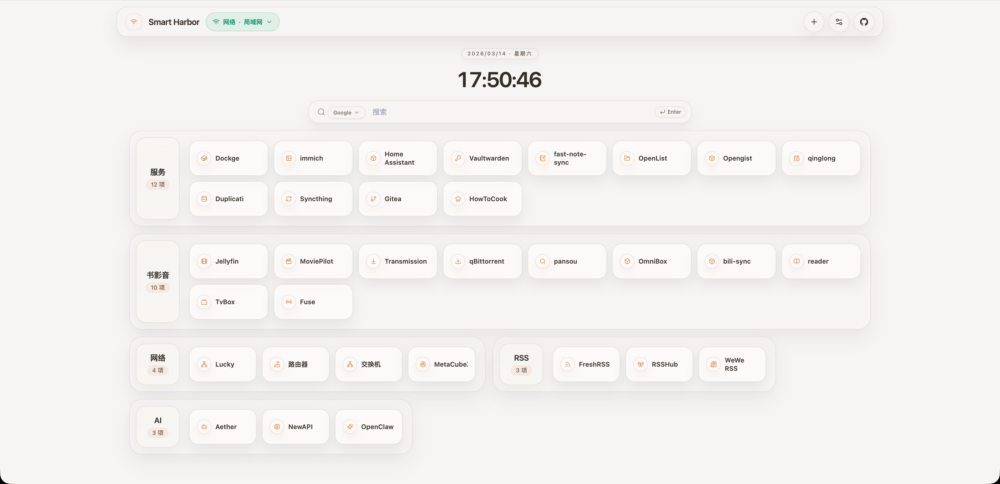
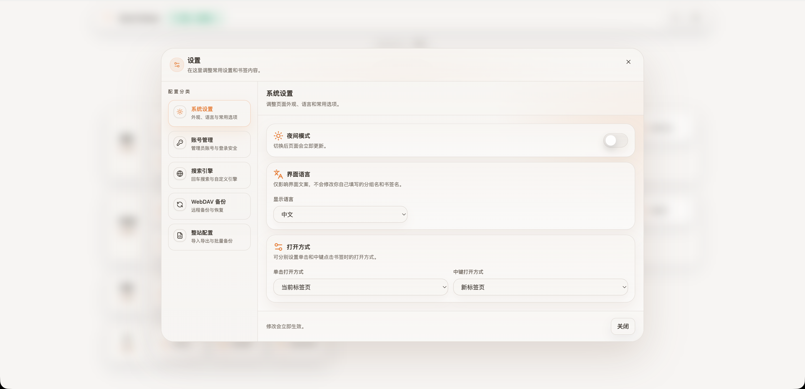
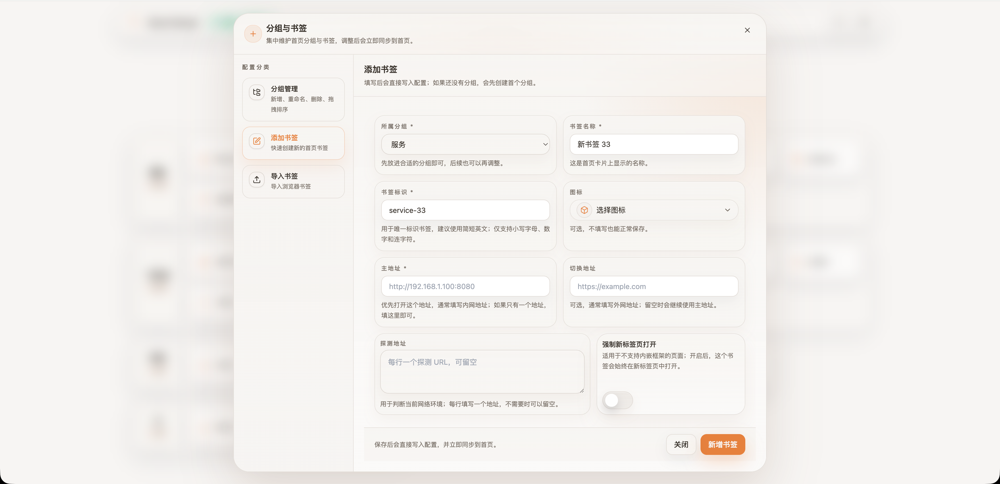
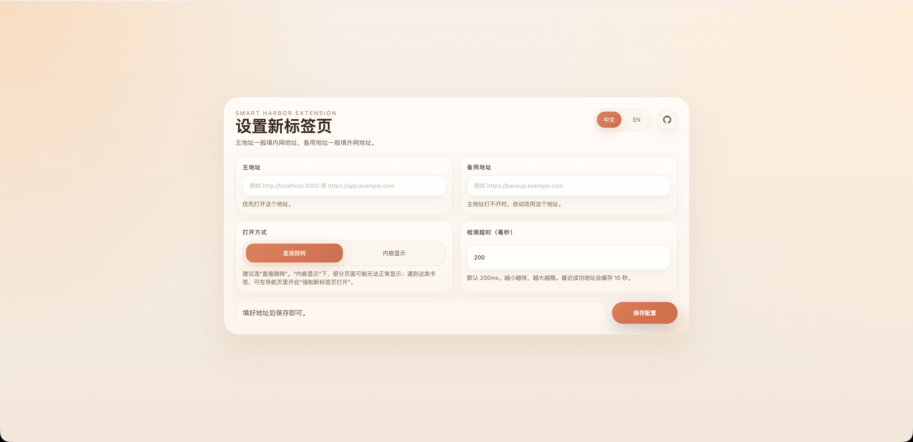

# Smart Harbor

[中文](README.zh-CN.md)

Smart Harbor is an intelligent start page for personal self-hosted services.

It automatically detects your current network environment and switches between LAN and public URLs to always choose the most suitable access point.

## Preview

### Home Page



### Settings Panel



### Bookmark Manager



### Chrome New Tab Extension



## Why Use It

- Automatic LAN/WAN routing for each bookmark
- Drag-and-drop bookmark groups with icon support
- Built-in and custom search engines
- WebDAV backup, restore, and version retention
- Password-protected admin panel with lockout protection
- Optional Chrome new tab extension

## Quick Start

### Docker Compose

```yaml
services:
  smart-harbor:
    image: goalonez/smart-harbor:latest
    container_name: smart-harbor
    ports:
      - 8080:80
    volumes:
      - ./smart-harbor/config:/app/config
    restart: unless-stopped
```

### Docker Run

```bash
docker run -d \
  --name smart-harbor \
  -p 8080:80 \
  -v ./smart-harbor/config:/app/config \
  goalonez/smart-harbor:latest
```

Then:

1. Open `http://localhost:8080`.
2. Create your admin account on first visit.
3. Add bookmark groups and services from the settings panel.

## Configuration

On first start, Smart Harbor writes a single `config.json` into your mounted config directory.

- Host path example: `./smart-harbor/config/config.json`
- Container path: `/app/config/config.json`

### Common fields

| Path | What it controls |
| --- | --- |
| `system.appName` | Site title shown in the page header and browser tab |
| `system.darkMode` | Light or dark theme |
| `system.clickOpenTarget` | Where normal clicks open services and search results |
| `system.middleClickOpenTarget` | Where middle-click opens services and search results |
| `system.defaultSearchEngine` | Default engine used by the search box |
| `system.webdavBackup` | Backup destination, schedule, and retention policy |
| `services[].category` | Bookmark group name |
| `services[].items[]` | Bookmarks inside each group |

<details>
<summary>Full config reference</summary>

#### `system`

| Path | Description | Notes |
| --- | --- | --- |
| `system.appName` | Application name shown in the UI and browser tab | Default `Smart Harbor` |
| `system.darkMode` | Enables dark theme | `true` or `false` |
| `system.clickOpenTarget` | Open target for normal clicks | `self` or `blank` |
| `system.middleClickOpenTarget` | Open target for middle-click | `self` or `blank` |
| `system.defaultSearchEngine` | Default search engine ID | Must match a built-in or custom engine |
| `system.customSearchEngines[]` | Custom search engine list | Optional |
| `system.customSearchEngines[].id` | Stable custom engine identifier | Lowercase letters, numbers, and hyphens |
| `system.customSearchEngines[].name` | Display name for the custom engine | Non-empty string |
| `system.customSearchEngines[].urlTemplate` | Search URL template | Must include `{keyword}` |
| `system.webdavBackup.url` | WebDAV endpoint URL | Leave empty to disable backup |
| `system.webdavBackup.username` | WebDAV username | Required when backup is configured |
| `system.webdavBackup.password` | WebDAV password or app password | Required when backup is configured |
| `system.webdavBackup.remotePath` | Remote backup folder | Default `/smart-harbor` |
| `system.webdavBackup.autoBackup` | Enables scheduled backup | `true` or `false` |
| `system.webdavBackup.intervalDays` | Days between automatic backups | Integer from `1` to `365` |
| `system.webdavBackup.maxVersions` | Number of remote backup versions to keep | Integer from `1` to `365` |
| `system.auth.username` | Admin username stored after setup | Created from the setup form |
| `system.auth.passwordHash` | Hashed admin password | Never store plaintext here |

#### `services`

| Path | Description | Notes |
| --- | --- | --- |
| `services[]` | Top-level bookmark groups | Array |
| `services[].category` | Group name shown in the UI | Non-empty string |
| `services[].items[]` | Services inside a group | Array |
| `services[].items[].slug` | Stable service identifier | Lowercase letters, numbers, and hyphens |
| `services[].items[].name` | Service display name | Non-empty string |
| `services[].items[].icon` | Lucide icon name | Optional |
| `services[].items[].primaryUrl` | Preferred address, usually LAN | Required URL |
| `services[].items[].secondaryUrl` | Fallback address, usually WAN | Optional URL |
| `services[].items[].probes[]` | Probe URLs used to detect network reachability | Optional; one or more URLs |
| `services[].items[].forceNewTab` | Always open this bookmark in a new tab | Optional boolean |

</details>

<details>
<summary>Example <code>config.json</code></summary>

```json
{
  "system": {
    "appName": "Smart Harbor",
    "darkMode": false,
    "clickOpenTarget": "self",
    "middleClickOpenTarget": "blank",
    "defaultSearchEngine": "google",
    "customSearchEngines": [
      {
        "id": "my-search",
        "name": "My Search",
        "urlTemplate": "https://example.com/search?q={keyword}"
      }
    ],
    "webdavBackup": {
      "url": "https://dav.example.com/remote.php/dav/files/demo",
      "username": "demo",
      "password": "app-password",
      "remotePath": "/smart-harbor",
      "autoBackup": true,
      "intervalDays": 7,
      "maxVersions": 10
    },
    "auth": {
      "username": "admin",
      "passwordHash": "<generated-after-setup>"
    }
  },
  "services": [
    {
      "category": "Infrastructure",
      "items": [
        {
          "slug": "proxmox",
          "name": "Proxmox",
          "icon": "Server",
          "primaryUrl": "http://192.168.1.10:8006",
          "secondaryUrl": "https://proxmox.example.com",
          "probes": [
            "http://192.168.1.1"
          ],
          "forceNewTab": true
        }
      ]
    }
  ]
}
```

</details>

## Account And Security

- First visit walks you through creating an admin account.
- Remove the `system.auth` section from `config.json` if you need to reset login credentials.
- After 5 failed login attempts, access is locked for 30 minutes.

## Chrome New Tab Extension

Use the bundled extension when you want every Chrome new tab to open Smart Harbor.

- `primaryUrl`: first address to try, usually your LAN URL
- `fallbackUrl`: backup address, usually your public URL
- `openMode`: `embedded` keeps Smart Harbor inside the new tab page; `direct` redirects immediately
- `probeTimeoutMs`: request timeout for address detection, default `200`
- Clicking the extension toolbar icon opens the settings page

### Install

1. Download the package from GitHub Releases, or build it locally.
2. Open `chrome://extensions`.
3. Enable Developer mode.
4. Click `Load unpacked`.
5. Select `extension/smart-harbor-new-tab-v<version>`.

### Build Locally

```bash
npm run build:extension
npm run package:extension
```

Generated output:

- Folder: `extension/smart-harbor-new-tab-v<version>`
- Zip: `extension/smart-harbor-new-tab-v<version>.zip`

## Development

```bash
npm install
npm run dev
```

- Web: `http://localhost:3000`
- API: `http://localhost:3001`

Useful commands:

```bash
npm run lint
npm run test
npm run build
npm run preview
```

## Tech Stack

React 19, TypeScript, Vite, Tailwind CSS, Zustand, TanStack Query, Fastify, and Zod.

## Thanks

Thanks to OpenAI Codex and Claude for supporting implementation, iteration, and documentation work on this project.

## License

[Apache-2.0](LICENSE)
